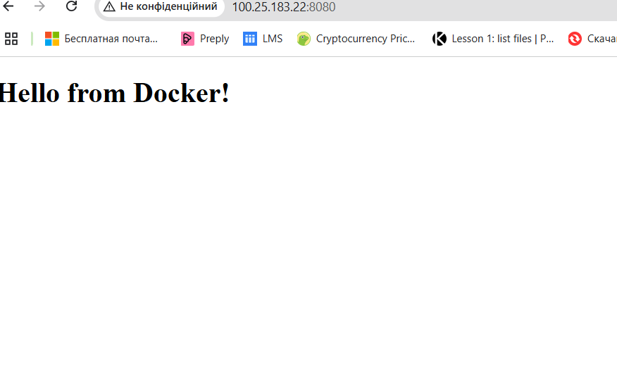

###EC2 підняв за допомогою тераформу на авс. 
Інстанс має білу адресу але вона може змінитися після перезавантаження, просто не захотів використовувати еластік айпі ізза вартості))
###Докер встановив та запустив за допомогою ансібла

###Перевірка докера на сервері
###Докер працює.
[ec2-user@ip-10-0-1-41 ~]$ sudo docker info
`Client:                                                    
Version:    25.0.8                                        
Context:    default                                       
Debug Mode: false                                         
Plugins:                                                  
buildx: Docker Buildx (Docker Inc.)                      
Version:  0.12.1                                       
Path:     /usr/libexec/docker/cli-plugins/docker-buildx

Server:
Containers: 1
Running: 0
Paused: 0
Stopped: 1
Images: 1
Server Version: 25.0.8
Storage Driver: overlay2
Backing Filesystem: xfs
Supports d_type: true

`
###Плейбук для встановлення компоса та його запуску
TASK [Перевіряємо, чи вже є /home/ec2-user/docker-compose] ********************************************************************************************************************************************************
ok: [100.25.183.22]

TASK [Встановлюємо Docker Compose, якщо ще не встановлений] *******************************************************************************************************************************************************
changed: [100.25.183.22]

TASK [Перевіряємо версію docker-compose (через повний шлях)] ******************************************************************************************************************************************************
ok: [100.25.183.22]

TASK [Виводимо версію] ********************************************************************************************************************************************************************************************
ok: [100.25.183.22] => {
"compose_version.stdout": "Docker Compose version v2.36.0"
}

PLAY RECAP ********************************************************************************************************************************************************************************************************
100.25.183.22              : ok=5    changed=1    unreachable=0    failed=0    skipped=0    rescued=0    ignored=0
###Далі роблю плейбук який копіює файли компоса та штмл на сервер та потім запускає компос файл
ec2-user-cache-1   redis:latest   "docker-entrypoint.s…"   cache     15 minutes ago   Up 15 minutes   6379/tcp
ec2-user-db-1      postgres:13    "docker-entrypoint.s…"   db        15 minutes ago   Up 15 minutes   5432/tcp
ec2-user-web-1     nginx:latest   "/docker-entrypoint.…"   web       15 minutes ago   Up 15 minutes   0.0.0.0:80->80/tcp, [::]:80->80/tcp

### Перевірка роботи нджінкса

